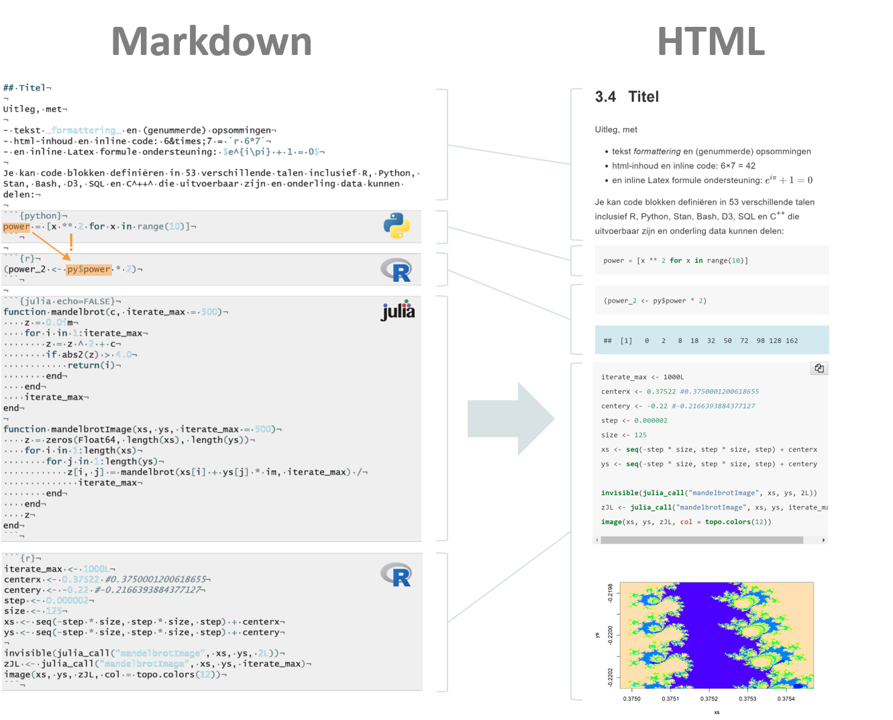

```{r include=FALSE}
library(knitr)
library(data.table)
library(magrittr)

opts_chunk$set(echo = TRUE, cache = TRUE, message = FALSE,
  warning = FALSE)

dyad <- readRDS("r/Palette_5YR_5B_Dyad.RDS")
palette(dyad[c(9, 20, 66)])
```

# Inleiding tot het onderdeel ML-Agents

## In een notedop

In dit opleidingsonderdeel ga je in teamverband aan de slag met de Unity game engine en leer je de 3D-toepassingen ontwikkelen. Deze 3D-toepassingen gaan van games tot interactieve Virtual Reality applicaties. Je leert werken met verschillende camera perspectieven, de physics engine, geluid, licht en scripts. Met ML-Agents Toolkit leer je hoe je met artificiële intelligentie een virtuele omgeving en zijn agents kunt laten aanpassen aan impulsen van buitenaf. Dit archief biedt hulp bij het gebruik van ML-agents en geeft ook een algemene introductie tot ML.

## Leerdoelen

Hieronder, in Tabel \@ref(tab:leerdoelen),  staan de leerdoelen opgesomd zoals ze vermeld staan in de ECTS fiches die van toepassing zijn voor dit onderdeel van het OLOD _VR Experience_. In de cursus zal er naar deze leerdoelen verwezen worden met vermelding van de bijhorende code.

Table: (\#tab:leerdoelen) Leerdoelen voor deze cursus

|Code|Omschrijving|
|-|-|
|TI_LD568|Begrijpt de principes van artificiële intelligentie|
|TI_LD569|Ontwikkelt een AI-module dat een cruciaal onderdeel vormt van een Unity project|
|TI_LD570|Gebruikt en kent specifieke ML bibliotheken|
|TI_LD571|Traint, test en evalueert een machine learning algoritme volgens de regels van de kunst|

## Cursus vorm

Deze cursus is geschreven in een versie van Markdown. Markdown is een familie van zogenaamde opmaaktalen (eng: _mark-up languages_) die ervoor zorgen dat inhoud van het document in verscheidene formaten weergegeven kan worden: PDF, HTML, &hellip;. Het loskoppelen van inhoud betekent enerzijds dat de auteur zich kan focusseren op de inhoud in plaats van de vorm. Anderzijds betekent het dat de lezer in staat is zijn de vorm van de uitvoer te bepalen, bijvoorbeeld, beter leesbaarheid, donkere achtergrond, &hellip;. Voor meer technische documenten biedt Markdown nog veel belangrijkere voordelen. Het maakt het mogelijk om code in de ene of andere taal tussen de lyrische tekst te plaatsen en uit te voeren. Met de juiste IDE (Integrated Development Environment), betekent dit dat de auteur én de lezer in staat zijn om in meerdere programmeertalen tegelijkertijd te werken! 

```{r markdown, echo=FALSE, fig.cap="(ref:markdown)"}

```

(ref:markdown) Werking van Markdown. De platte tekst (links) wordt omgezet naar een ander formaat (rechts; hier HTML) door een externe tool als [Pandoc](https://pandoc.org/). Stijl-regels worden hier automatisch uitgevoerd maar de auteur heeft de mogelijkheid ook deze in detail te configureren. Naast het scheiden van vormgeving en inhoud (hetgeen een merkelijke efficiëntie verbetering met zich meebrengt) ondersteund [R Markdown](https://rmarkdown.rstudio.com/) ook meertaligheid, i.e. meerdere programmeertalen in één document. Tussen een aantal talen is er zelfs wederzijdse uitwisseling mogelijk van de actieve variabelen (zie oranje markeringen met pijl). Het voorbeeld met de Mandelbrot fractaal is afkomstig van @mandelbrotjulia, waarvan de GitHub repository een bondige beschrijving geeft van de Mandelbrot verzameling (eng: _Mandelbrot set_) met een test die de performantie-winst van Julia t.o.v. R onderzoekt.


## Licentie voor deze cursus

De inhoud van deze cursus valt onder een GNU Affero General Public v3.0 licentie. Wat er toegelaten is en onder welke voorwaarden staat hieronder opgesomd:

| Je mag&hellip;                                                                            | Onder voorwaarde dat&hellip;                                                                                                                   | Je mag niet&hellip;                                                                                 |
| ----------------------------------------------------------------------------------------- | ---------------------------------------------------------------------------------------------------------------------------------------------- | --------------------------------------------------------------------------------------------------- |
| <span title="Dit materiaal gebruiken voor enig winstoogmerk.">Commercieel gebruik</span>  | <span title="De broncode moet beschikbaar worden gemaakt bij elke verspreiding ervan.">Ontsluit bron</span>                                    | <span title="De licentie beperkt de aansprakelijkheid van de auteur.">Aansprakelijk stellen</span>                     |
| <span title="Dit materiaal verspreiden">Verspreiden</span>                               | <span title="Een copy van deze licentie moet toegevoegd worden bij het verspreiden ervan.">Licentie en copyright notice mee verspreiden</span> | <span title="Er mogen geen garanties gekoppeld worden aan dit materiaal.">Garantie</span> |
| <span title="Het materiaal mag gewijzigd worden.">Aanpassen</span>                        | <span title="Alle gebruikers die met dit materiaal interageren via een netwerk krijgen toegang tot de broncode.">Netwerk verspreiding</span>   |                                                                                                     |
| <span title="Deze licentie omvat een 'express grant'.">Patenteren</span>                    | <span title="Alle verspreiding met of zonder modificatie moet onder dezelfde licentie gebeuren.">Zelfde licentie</span>                         |                                                                                                     |
| <span title="Mag voor privé doeleinden gebruikte en gezijzigd worden.">Privé gebruiken</span> | <span title="Alle aangebrachte wijzigingen moeten gedocumenteerd worden">Bekendmaking wijzigingen</span>                                       |                                                                                                     |

## Verwijzen naar deze cursus

_In Bibtex-formaat:_

<code>
&#64;online{dhaese2020ml-agents,<br>
&nbsp;&nbsp;&nbsp;&nbsp;author = {D'Haese, David},<br>
&nbsp;&nbsp;&nbsp;&nbsp;title = "VR Experience (ML-agents)",<br>
&nbsp;&nbsp;&nbsp;&nbsp;year = "2020",<br>
&nbsp;&nbsp;&nbsp;&nbsp;url = "https://ddhaese.github.io/vr-experience/",<br>
&nbsp;&nbsp;&nbsp;&nbsp;note = "[Online; accessed <span>
<script> document.write(new Date().toISOString().substring(0, 10) + ']"');</script></span>&nbsp;&nbsp;}
</code>

_[APA-formaat](https://apastyle.apa.org/):_

D’Haese, D., 2020. VR-Experience (ML-Agents) [WWW Document] [Online; accessed yyyy-mm-dd]. URL https://ddhaese.github.io/vr-experience/

___

<small>© 2020 David D'Haese</small>
