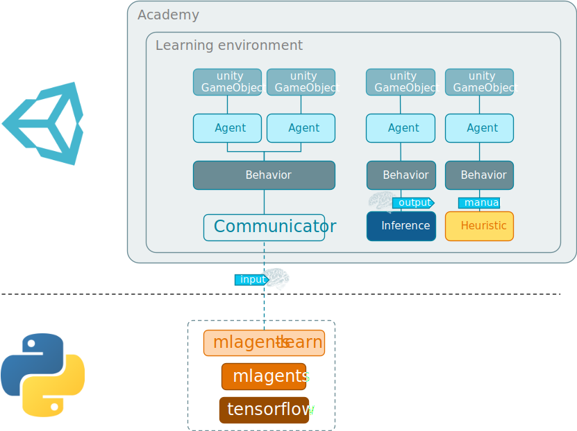
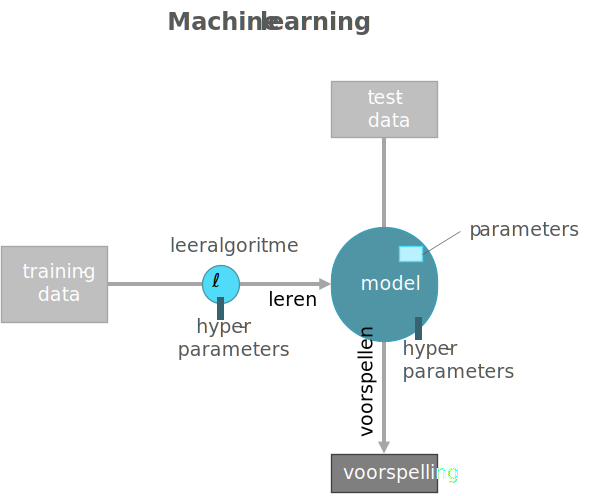
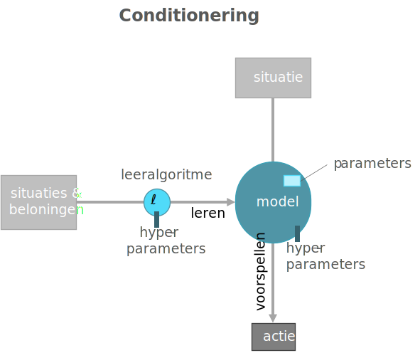
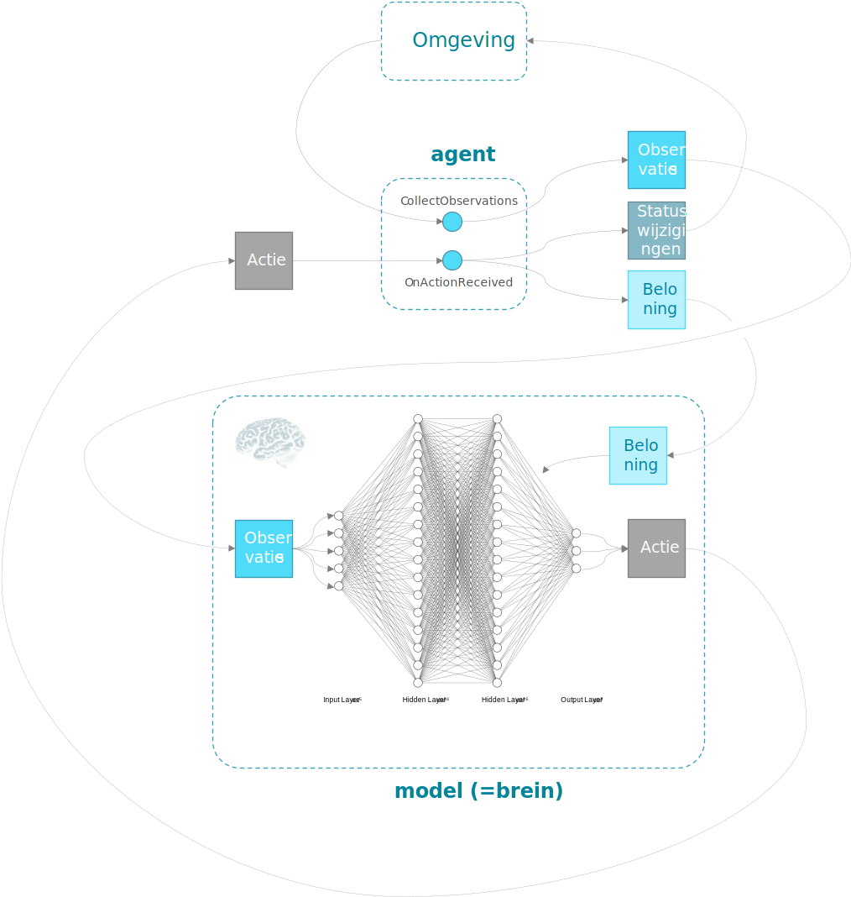
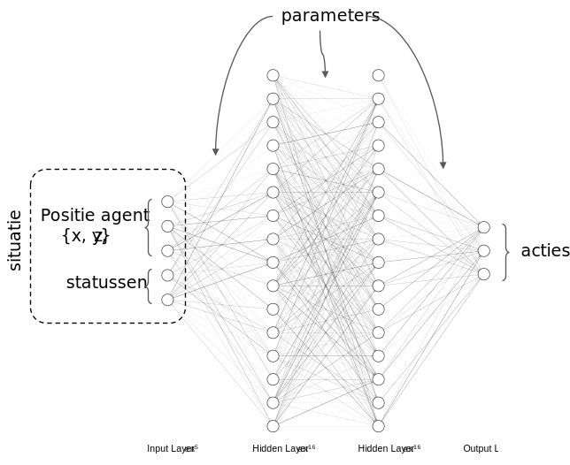

```{r include=FALSE}
library(knitr)
library(data.table)
library(magrittr)

opts_chunk$set(echo = TRUE, cache = TRUE, message = FALSE,
  warning = FALSE)

dyad <- readRDS("r/Palette_5YR_5B_Dyad.RDS")
palette(dyad[c(9, 20, 66)])
```

# Beginselen ML-Agents

## Vereiste voorkennis en voorinstallatie

Om onderstaande handleiding te kunnen volgen moet je eerst op [Digitap](https://learning.ap.be/course/view.php?id=36780) de volgende modules hebben afgewerkt:

- Week 1 - Introduction Virtual Reality 
- Week 2 - Introduction & Unity Basics
- Week 3 - Unity - Materials & lighting & audio, camera & deployment
- Week 4 - Physics , Player control & UI
- Week 5 - Shooter Game

De vereiste software voor dit onderdeel is Unity versie __2019.4.10__.

## Installatie

> __Opgelet__: De versie van de geïnstalleerde software speelt hier een belangrijke rol. ML-Agents is nog volop in ontwikkeling en de functionaliteiten kunnen tussen twee versies erg verschillen.

1. __Installeer ML Agents__: Unity heeft wat problemen gehad met het versioneren van hun product, dus moet je goed opletten @2020-ml-agents-versioning). Via de Package Manager van Unity installeer je ML Agents versie `1.0.5`. Dit zou moeten overeenkomen met de [GitHub Release 6](https://github.com/Unity-Technologies/ml-agents) repository.
1. __Installeer Python__:
   a. Wil je met een omgeving-manager werken zodat je in een afgezonderde omgeving kunt werken met zijn eigen specifieke set aan Python modules, dan kan  je [Anaconda](https://www.anaconda.com/) of de vereenvoudigde versie [Miniconda](https://docs.conda.io/en/latest/miniconda.html) downloaden in een folder waarvan het pad _geen spaties_ bevat. Je test deze installatie met het commando `conda info`. Je kan een ontwikkel omgeving (eng: _development environment_) maken met het commando `conda create -n ml-agents` en deze omgeving activeren met `conda activate ml-agents`  en deactiveren met `conda deactivate`. Met de _ml-agents_ omgeving actief kan je met de opdracht `python --version` controleren dat de versie van Python voldoende recent is (`3.8.1` of hoger) en met `pip install mlagents` installeer je de `mlagents` Python module
   b. Indien de geen omgeving-manager wenst te gebruiken of de installatie hiervan werkt niet goed op jouw machine, installeer dan gewoonweg de nieuwste versies van [Python](https://www.python.org/downloads/) en [pip](https://pip.pypa.io/en/stable/) en voer de opdracht `pip install mlagents` uit aan de prompt.
1. (_Optioneel, maar sterk aangeraden_) __Installeer voorbeelden__: Om toegang te hebben tot een aantal eenvoudige voorbeelden kopieer je best de repository met volgend git commando:

   ```cmd
   git clone --branch release_6 https://github.com/Unity-Technologies/ml-agents.git
   ```

Een gedetailleerde handleiding vind je [hier](https://github.com/Unity-Technologies/ml-agents/blob/release_6_docs/docs/Installation.md).

## ML-Agents Toolkit

De _Unity Machine Learning Agents Toolkit_ (of kortweg _ML-Agents_) stelt de spel- of simulatie-ontwikkelaar in staat om één of meerdere karakters (eng: _non-player characters_ of _NPCs_) of _agenten_ (eng: _agents_) intelligent te maken door deze een virtueel _brein_ mee te geven. Je bepaalt zelf wat je de agenten aanleert en dus wat er in het brein terechtkomt. Als het brein voldoende complex is en als er voldoende leertijd voorzien wordt zijn er bijna geen limieten aan wat je een agent kunt aanleren.

Hier is een voorbeeld:

<iframe width="600" height="318" src="https://www.youtube.com/embed/fiQsmdwEGT8" frameborder="0" allow="accelerometer; autoplay; clipboard-write; encrypted-media; gyroscope; picture-in-picture" allowfullscreen></iframe>

De toepassingen zijn legio:

- _Single-Agent_: Je traint één agent om iets uit zichzelf te leren op basis van observaties die de agent doet (zoals de overstekende kip uit de video hierboven).
- _Simultaneous Single-Agent_: Meerdere onafhankelijke karakters gekoppeld aan eenzelfde brein.
- _Adversarial Self-Play_: Meerdere karakters met hetzelfde brein maar tegenovergesteld beloningssysteem zodat de agent van zichzelf leert. Deze strategie is toegepast bij [AlphaGo](https://en.wikipedia.org/wiki/AlphaGo)
- _Cooperative Multi-Agent_: Meerdere agenten die leren samenwerken doordat ze een beloningssysteem delen.
- _Competitive Multi-Agent_: Meerdere teams van interagerende agenten. Het [soccer voorbeeld](https://www.youtube.com/watch?v=Hg3nmYD3DjQ) illustreert deze strategie.
- _Ecosystem_: Complex systeem met meerdere agenten elke met onafhankelijke beloningssystemen.

De onderstaande figuur biedt een overzicht van de elementen in de ML-Agents toolkit.

```{r mlagents-system, fig.cap="(ref:mlagents-system)", echo=FALSE}

```

(ref:mlagents-system) Overzicht van de elementen van de ML-Agents toolkit. De Academy zorgt ervoor dat de agenten gesynchroniseerd zijn en beheert de nodige omgeving-brede instellingen. Gebaseerd op [bron](https://github.com/Unity-Technologies/ml-agents/blob/release_6_docs/docs/ML-Agents-Overview.md).

## Machine learning in een notedop

Machine learning (ML) is het vermogen van een algoritme om te _leren uit data_. Centraal in het proces-diagram van ML bevindt zich het leeralgoritme dat data  omzet naar een model. Dit model kan men beschouwen als een functie dat op basis van gelijkaardige data nieuwe voorspellingen kan doen. Een model bestaat uit logica en parameters.

```{r ml-proces, fig.cap="(ref:ml-proces)", echo=FALSE}

```

(ref:ml-proces) Vereenvoudigd proces-diagram voor ML. Cirkels stellen acties voor, rechthoeken stellen objecten of statussen voor. Het leeralgoritme kan dus beschouwd worden als een _function-factory_. Het ML proces kan geconfigureerd worden door middel van hyperparameters.

```{definition def-ml}
Machine learning (ML) is het vermogen van een algoritme om te <b>leren uit data</b>.
```

Er zijn verscheidene vormen, maar het komt er meestal op neer dat op basis van data een model wordt gemaakt. De vorm van ML waar we hier mee in contact komen is conditionering (eng: _reinforcement learning_) Zulk een conditionering-model kan men beschouwen als een functie die op basis van een bepaalde situatie de meest aangewezen actie probeert te voorspellen op basis van een beloning-systeem. Bijvoorbeeld, het model moet aanleren dat bij de situatie:

<q>&hellip;er is een wagen rechts van me die met hoge snelheid nadert&hellip;</q>

een gepaste actie zou kunnen zijn:

<q>Zet snel twee stappen naar voren</q>

Bij de situatie:

<q>&hellip;er staat een boom vlak voor mijn neus&hellip;</q>

zou dan weer de volgende actie passen:

<q>Zet een stap opzij.</q>

Bij een conditionering bestaat de data dus uit de situaties (algemeen de set van de toestanden waarin de verscheidene agenten zich bevinden) en de beloningen die worden uitgereikt op basis van eerdere genomen acties.

```{r conditionering, fig.cap="(ref:conditionering)", echo=FALSE}

```

(ref:conditionering) Vergelijk met Figuur \@ref(fig:ml-proces), de data bestaat uit een situatie (een set van statussen) en een beloning op de acties die door het model in spe eerder werden voorgesteld.

De standaard levenscyclus van een unity-omgeving (eng: _environment_) wordt tijdens het trainen van de agenten uitgebreid het doorlopen van de zogenaamde epochs (ook wel _steps_) van het NN. De twee systemen, TensorFlow en Unity, hebben wel een zekere onafhankelijkheid en communiceren aan de hand van buffers. Zo bestaat er een _experience buffer_ die de observaties vanuit Unity verzameld en van waaruit het NN ten gepaste tijde de invoerlaag mee voed.

## Interactie tussen het NN en de Unity omgeving

Tijdens de trainingsfase zal het NN acties voorstellen. In het begin zullen dit willekeurige acties zijn en als alles goed loopt, worden de acties gaandeweg 'intelligenter'. De acties worden vanuit het NN naar Unity verstuurd waar deze (in de `OnActionReceived` methode, zie later) worden ontvangen, omgezet naar werkelijke bewegingen (of andere status wijzigingen) van de agent en vertaald naar een beloning. Op geregelde tijdstippen wordt de geaccumuleerde beloning tenslotte vanuit Unity naar het NN verstuurd alwaar ze gebruikt zullen worden om de parameters ('connecties') van het NN op geschikte wijze aan te passen. Hoe dit laatste precies gebeurt, valt buiten het bereik van deze korte introductie.

```{r conditionering-detail, fig.cap="(ref:conditionering-detail)", echo=FALSE}

```

(ref:conditionering-detail) Een detail van het conditioneringsproces. Het model wordt in dit geval door Python afgehandeld en er is een _Python Low-Level API_ om te communiceren tussen Python en de Unity Academy.

Indien een leeralgoritme van het conditionering-type gebruik maakt van neurale netwerken, spreekt men van _deep reinforcement learning_. Het model ziet er dan als volgt uit:

```{r deep-reinforcement-learning, fig.cap="(ref:deep-reinforcement-learning)", echo=FALSE}

```

(ref:deep-reinforcement-learning) Neuraal netwerk (NN) toegespitst op conditionering. De parameters zijn de gewichten van de connectoren. De verschillende gewichten worden hier voorgesteld met verschillende lijndiktes voor de connectoren. De positie van de agent dient hier als voorbeeld, men kiest vrij welke data als invoer dienen voor het netwerk.

Informatie vloeit van links naar rechts. Links komen de observaties en de statussen binnen. Samen worden deze hier de situatie genoemd (ook wel _ervaring_,  eng: _experience_) en hiermee wordt de invoer-laag (eng: _input layer_) van het netwerk opgevuld. Via allerhande matrix vermenigvuldigingen bekomt men de voorspelde acties uit, hier gecodeerd door middel van drie natuurlijke getallen. De acties worden naar de Unity-omgeving gestuurd en daar gaan deze acties dus omgezet worden naar status-wijzigingen van het spelobject van de agent. Bijvoorbeeld, de agent zet een stap naar voren. Indien, als gevolg van deze stap naar voren, de agent in botsing treedt (eng: _collision_) met een object en het daarvoor ook beloond wordt, vloeit deze beloning terug naar het NN waar de parameters aangepast worden waardoor in de toekomst het NN aangemoedigd wordt om in dezelfde omstandigheden opnieuw een stap naar voren te zetten.
