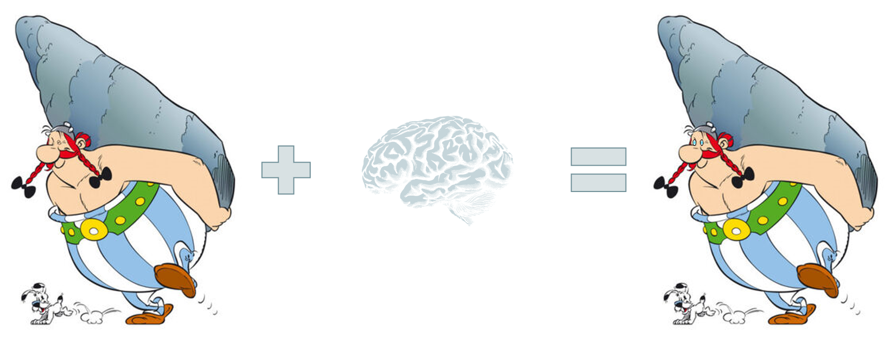
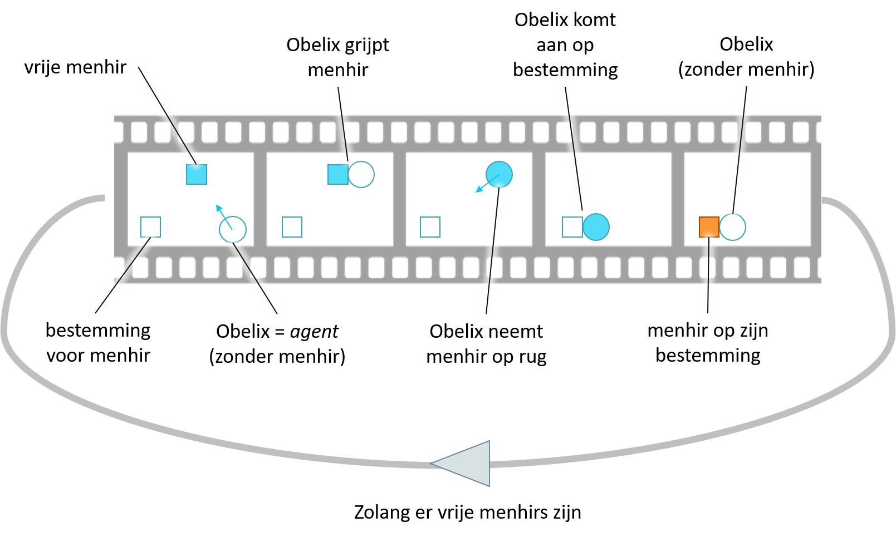
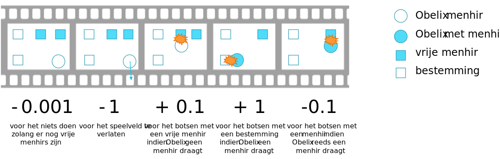
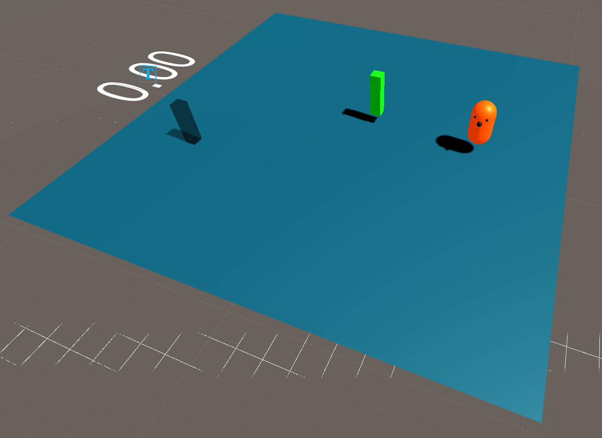
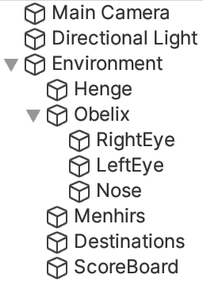
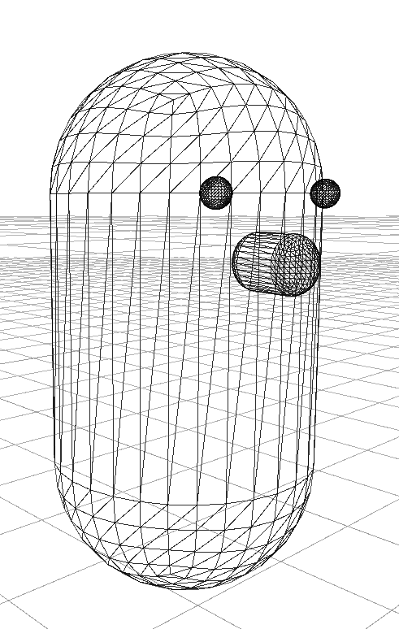
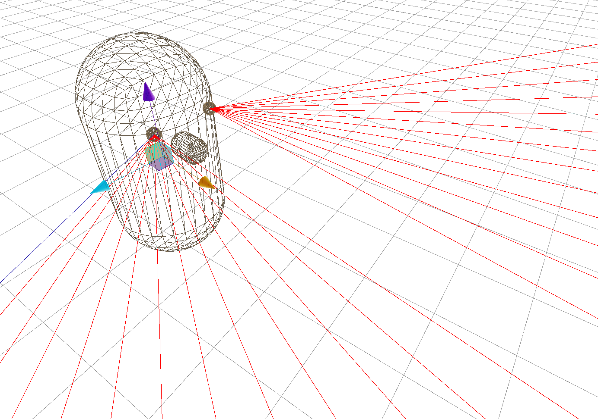
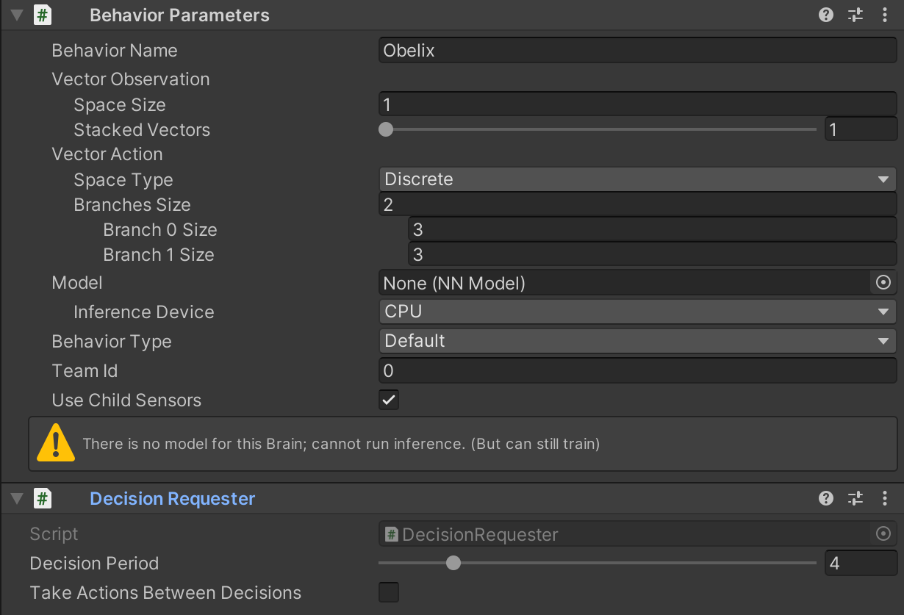
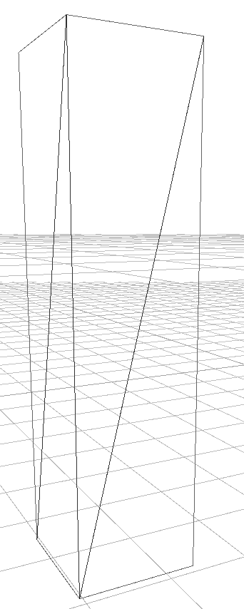
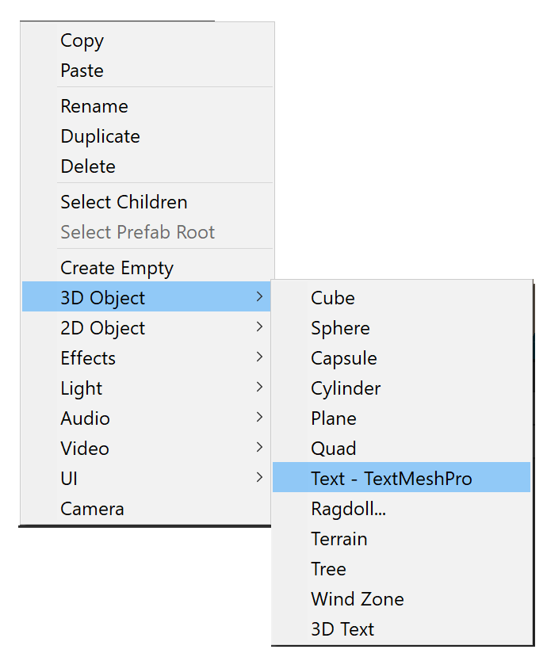

```{r include=FALSE}
library(knitr)
library(data.table)
library(magrittr)

opts_chunk$set(echo = TRUE, cache = TRUE, message = FALSE,
  warning = FALSE)

dyad <- readRDS("r/Palette_5YR_5B_Dyad.RDS")
palette(dyad[c(9, 20, 66)])
```

# Obelix de menhirhouwer

## Inleiding tot de usecase

Vele mensen kennen de verhalen van Asterix en Obelix. Hierin speelt Obelix de rol van een menhirhouwer met bovennatuurlijke krachten. Spijtig genoeg is hij nogal naïef en doet hij wel eens domme dingen. Laten we daar verandering in brengen door Obelix een brein te geven!

```{r obelix, fig.cap="(ref:obelix)", echo=FALSE}

```

(ref:obelix) Kunnen we Obelix de menhirhouwer een tikkeltje slimmer maken? <small>[bron afbeelding van Obelix](https://asterix.fandom.com/fr/wiki/Ob%C3%A9lix)</small>.

## Het spelverloop

Het spelverloop wordt hieronder schematisch voorgesteld. Obelix is het hoofdpersonage en moet op zoek naar vrije menhirs. Aangekomen bij een menhir moet hij deze op zijn rug nemen en op zoek gaan naar een bestemming.

```{r spelverloop, fig.cap="(ref:spelverloop)", echo=FALSE}

```

(ref:spelverloop) Het spelverloop hier uitgebeeld voor een enkele vrije, stilstaande menhir.

## Observaties, acties en beloning

Er zijn drie zaken waarover je bij een conditionering altijd eerst rustig moet nadenken alvorens als een gek te beginnen ontwikkelen of ontwerpen: _observaties_, _acties_ en _beloning_.

```{definition obervaties, name="Observaties"}
Observaties die de agent maakt op basis van de omgeving vormen de invoer voor het leeralgoritme.
```

In het geval van Obelix zijn de observaties diegene die hij maakt door rond te 'kijken'. We gaan zien dat ML-Agents ons hierbij helpt door componenten aan te bieden voor visuele perceptie.

```{definition acties, name="Acties"}
Acties bepalen de bewegingsvrijheid van een agent of, algemener gesteld, de impact die een agent heeft op zijn omgeving.
```

Zolang de agent niet veranderd in geen enkel van zijn eigenschappen (positie, snelheid, kleur, tags,&hellip;) dan kan het leeralgoritme daar niets mee, want wat het ook voorstelt als te ondernemen actie, er gebeurt toch niets. Voor Obelix is het al duidelijk geworden dat hij moet kunnen rondkijken om ervoor te zorgen dat er een menhir of bestemming in het gezichtsveld treedt. Verder moet hij kunnen 'rondlopen' zodat hij een menhir of bestemming kan benaderen. Als we er van uitgaan dat het opnemen van de menhir en daarna het lossen van de menhir op een bestemming volautomatisch gebeurt (i.e. hij moet er gewoon maar mee botsen) dan zijn er geen verdere acties die Obelix moeten kunnen ondernemen. De details van het roteren en het rondlopen bespreken we later.

```{definition beloning, name="Beloning"}
Het beloningsmechanisme (eng: _rewards_, _incentives_) vertelt het leeralgoritme of de voorgestelde actie de agent dichter bij het einddoel van de leeroefening brengt of niet.
```

Figuur \@ref(fig:obelix-beloning) geeft een overzicht van het beloningssysteem voor de Obelix simulatie. Het einddoel is het plaatsen van de menhir op een bestemming en dus daar krijgt het leeralgoritme de grootste score voor. Voor het naderen van een menhir of een bestemming krijgt de agent enkel een (matige) beloning indien het zich in de juiste staat bevindt. Bijvoorbeeld, als Obelix al een steen op zijn rug draagt, krijgt hij geen extra punten om een andere menhir te benaderen, want twee menhirs op de rug is misschien toch wat veel van het goede (in deze versie, natuurlijk kan je dit aanpassen).

```{r obelix-beloning, fig.cap="(ref:obelix-beloning)", echo=FALSE}

```
(ref:obelix-beloning) Het beloningssysteem voor de Obelix-simulatie.

## Het speelveld

Laten we beginnen met alle componenten te bouwen om de simulatie te bouwen. Merk op dat het verstandig is om eerst de ML logica in te bouwen alvorens je de spelobjecten tot in het detail uitwerkt. Dat is ook wat we hier gaan doen.

```{r speelveld, fig.cap="(ref:speelveld)", echo=FALSE}

```

(ref:speelveld) Het speelveld met 5 spelobjecten.

## Spelomgeving

### Speelveld object

Het speelveld krijgt de naam `Henge` en is een eenvoudig vlak met schaal X = Y = Z = 2 en posities en rotatie op  X = Y = Z = 0 en met een _Mesh Collider_. Dit en alle andere objecten zitten vervat in een container object `Environment` zodat het geheel later eenvoudig gedupliceerd kan worden.


```{r objecten, fig.cap="(ref:objecten)", echo=FALSE}

```

(ref:objecten) De volledige hiërarchie binnen de spelobjecten met hun namen zoals ze in deze handleiding gebruikt zullen worden. Merk op dat de `Menhir` en `Destination` objecten als prefab zullen worden gedefinieerd zodat men hier meerdere instanties van kan genereren (eng: _to spawn_) tijdens de initialisatie van de simulatie.

### Obelix spelobject

```{r obelix-object, fig.cap="(ref:obelix-object)", echo=FALSE}

```

(ref:obelix-object) Obelix spelobject. Zie tekst voor de eigenschappen van dit object.

Dit is het enige composiet spelobject met het cilindrisch lichaam `Obelix`, een rechteroog (`RightEye`), een linkeroog (`LeftEye`) en een neus (`Nose`). Het lichaam zelf is een capsule met schaal 1 in alle richtingen. Het bevat een passende _Capsule collider_ en een _Rigid body_ component met de rotatie-vrijheid beperkt tot enkel de y-as (dus _freeze rotation_ X en Z aangevinkt). De ogen en de neus worden als dochter-componenten van het lichaam aangemaakt en bestaan uit bollen, respectievelijk een capsule, telkens met hun gepaste en aansluitende collider. Zorg dat het composiet object voldoende boven de grond is (y = 1.5) zodat hij netjes op het speelveld valt.

De acties die Obelix gaat doen zijn gebaseerd op observaties. Zorg er dan ook voor dat beide ogen van Obelix kunnen 'zien' door aan beide ogen een _Ray Perception Sensor 3D_ toe te voegen met de volgende eigenschappen (hier voor het links oog weergegeven).

|Eigenschap|Waarde|Uitleg|
|-|-|-|
|`Sensor Name`|`LeftEye`|Unieke naam is belangrijk|
|`Detecable Tag`s|`2`: `Menhir` en `Destination`|De objecten die Obelix kan zien|
|`Rays Per Direction`|6|Aantal stralen aan weerszijden van middellijn.|
|`Max Ray Degrees`|30|Voor een zicht van 60° per oog.|
|`Sphere Cast Radius`|3.5|De dikte van elke straal|
|`Ray Length`|260|Lengte van de stralen in _dm_|
|`Stacked Raycasts`|1|Geheugen voor de sensor|
|`Start`/`End Vertical Offset`|0/0|Naar boven of naar onder kijken|

Obelix krijgt dus een zicht van 120°. Hij zal zich dus moeten draaien om een volledig beeld te krijgen van zijn omgeving. De lengte van de stralen is zodanig gekozen dat hij van de ene hoek van het speelveld nog net een object in de tegenoverstaande hoek kan zien. 

Doe hetzelfde voor het rechteroog (je kan de component eenvoudig kopiëren). Roteer nu de ogen +/-30° volgens de Y-as zoals getoond op Figuur \@ref(fig:obelix-ray-perception) zodat er een zo breed mogelijk gezichtsveld benut wordt (dus geen overlap). 

```{r obelix-ray-perception, fig.cap="(ref:obelix-ray-perception)", echo=FALSE}

```

(ref:obelix-ray-perception) De _Ray Perception Sensor 3D_ component in actie.

> Er zijn ook andere componenten die van de betrokken `ISensor` interface overerven, namelijk `CameraSensorComponent` waarmee camerabeelden als pixel-matrices aan het NN worden doorgegeven of `RenderTextureSensorComponent` die de inhoude van zogenaamde [_Render Textures_](https://docs.unity3d.com/Manual/class-RenderTexture.html) als invoer gebruikt voor het NN.

Voeg verder twee componenten toe aan Obelix: _Behavior Parameters_ (het gedrag van de agent) en _Decision Requester_. (een automatische trigger om de agent te dwingen iets te doen). We zullen deze componenten waar nodig gaandeweg configureren.



### De menhir en de bestemming

De menhir en de bestemming prefabs worden eenvoudig geconstrueerd als kubussen met schaal {XYZ: 0.5, 2, 0.5} met een passende _Box Collider_. De verschillen tussen de `Menhir` prefab en de `Destination` prefab staan hieronder opgesomd:

```{r menhir-object, fig.cap="(ref:menhir-object)", echo=FALSE}

```

(ref:menhir-object) De menhir bestaat uit een eenvoudige balk.

|Eigenschap|Menhir|Destination|
|-|-|-|
|`Rigidbody` component|`Use Gravity` aan en `Freeze Rotation` voor de assen X en Z|Geen `Rigidbody` component.|
|Startpositie (Y)|Boven het veld, valt bij opstart tot op speelveld|Rustend op het speelveld|
|Tag|`Menhir`|`Destination`|

Je kan ze natuurlijk best ook met een verschillend materiaal bekleden zodat ze gemakkelijk te onderscheiden zijn.

Tenslotte nog dit: maak een tag aan via de Unity GUI met de naam `MenhirInPlace`. Dit zal later gebruikt worden om aan te geven wanneer een menhir op zijn bestemming staat.

### Scorebord



Dit object met naam `ScoreBoard` is een instantie van de `TextMeshPro` klasse (3D-Object) dat de gecumuleerde beloning (eng: _cumulative reward_) zal weergeven. Hier wijzig je de eigenschappen naar keuze. Het is weliswaar handig als je de score kan lezen vanuit het perspectief van de _main camera_.

