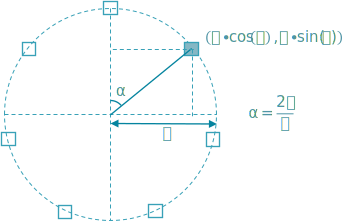
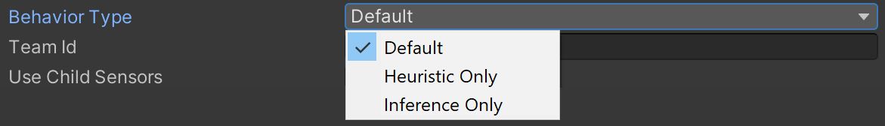
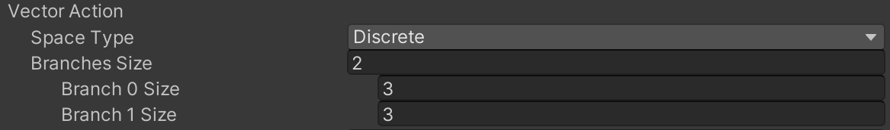

```{r include=FALSE}
library(knitr)
library(data.table)
library(magrittr)

opts_chunk$set(echo = TRUE, cache = TRUE, message = FALSE,
  warning = FALSE)

dyad <- readRDS("r/Palette_5YR_5B_Dyad.RDS")
palette(dyad[c(9, 20, 66)])
```


# Gedragingen van de agent en de andere spelobjecten

## Environment.cs

Wil je een agent een complexe handeling aanleren, i.e. een handeling dat je niet eenvoudig kan programmeren, dan zal je typisch de agent willen blootstellen aan een onvoorziene situatie. Wie onvoorzien zegt, zegt ook willekeurig en in `Environment.cs` bestaat een belangrijk deel van de code er dan ook in om de menhirs willekeurig op het speelveld te plaatsen. Kwestie om Obelix het niet te gemakkelijk te maken.

### Overzicht methoden op Environment

Maak een script met deze naam en koppel het aan het gelijknamig spelobject. De `Environment` klasse zal De volgende methoden bevatten:

- `RandomPosition`: het genereren van een willekeurige positie in het XZ vlak.
- `ClearEnvironment`: het opkuisen van eventuele spelobjecten van een vorige episode
- `SpawnStoneHenge`: het genereren van bestemmingen, netjes in een cirkel zoals bij Stonehenge (ongeveer toch)
- `SpawnMenhirs`: het genereren van de menhirs

### Object-variabelen op Environment

We beginnen bij een aantal publieke object-variabelen:

```c#
 public Destination destinationPrefab;
 public Menhir menhirPrefab;
 public Material matMenhirInPlace;

 public int menhirCount = 8;
 public float circleRadiusDestinations = 9;
 ```

De prefabs moeten hier door de ontwikkelaar manueel gekoppeld via de Unity GUI zodat je met een eenvoudige sleepbeweging een andere menhir of bestemming kunt koppelen.

Het materiaal `matMenhirInPlace` zal dienen om aan te geven wanneer een bestemming bezet wordt door een menhir en is bedoeld enkel voor de ontwikkelaar (dus niet cruciaal voor de simulatie zelf). `menhirCount` is een simulatie-parameter die bepaalt hoeveel {menhir, bestemming}-koppels er gecreëerd dienen te worden en `circleRadiusDestinations` bepaalt de straal van de Stonehenge. Door beide parameters publiek te maken, kan de ontwikkelaar ze eenvoudig wijzigen via de GUI van Unity.

De volgende variabelen zijn privaat en zorgen ervoor dat de simulatie-omgeving een referentie heeft naar de agent (`obelix`), het scorebord (`scoreBoard`) en de container-objecten voor de menhirs (`menhirs`) en bestemmingen (`destinations`).

```c#
 private Obelix obelix;
 private TextMeshPro scoreBoard;
 private GameObject menhirs;
 private GameObject destinations;
 ```

### Initializatie van Environment instantie

Tijdens de initialisatie zullen de bovenstaande referenties worden ingevuld:

```c#
public void OnEnable()
{
  destinations = transform.Find("Destinations").gameObject;
  menhirs = transform.Find("Menhirs").gameObject;
  scoreBoard = transform.GetComponentInChildren<TextMeshPro>();
  obelix = transform.GetComponentInChildren<Obelix>();
}
```

Merk op dat de `Find` en `GetComponentInChildren` methoden op de `transform` van `Environment` ervoor moeten zorgen dat uitsluitend dochter-objecten worden teruggegeven. Dit is belangrijk omdat we later de hele simulatie-omgeving gaan dupliceren binnen dezelfde scene. Andere methoden zoals `GameObject.FindGameObjectWithTag` zouden dus mogelijk de verkeerde referenties doorgeven, i.e. referenties naar objecten van een andere simulatie-omgeving, zonder hiervoor een foutmelding te geven.

### Opkuisen speelveld

Bij het begin van elke episode zal het veld opnieuw in zijn beginsituatie moeten worden alvorens nieuwe menhirs en bestemmingen te genereren: 

```c#
public void ClearEnvironment()
{
  foreach (Transform menhir in menhirs.transform)
  {
    GameObject.Destroy(menhir.gameObject);
  }

  foreach (Transform destination in destinations.transform)
  {
    GameObject.Destroy(destination.gameObject);
  }
}
```

### Score

Het scorebord moet continu de beloning (= _score_) weergeven en dit gebeurt eenvoudigweg door gebruik te maken van de getter van de interne `m_CumulativeReward` variabele op de `Agent` klasse:

```c#
private void FixedUpdate()
{
  scoreBoard.text = obelix.GetCumulativeReward().ToString("f2");
}
```

### Willekeurige positie

Het is belangrijk om het trainingsfase zo representatief mogelijk te maken voor de latere situaties waarmee het NN geconfronteerd zal worden. Hier is het belangrijk dat Obelix de menhirs op hun bestemming weet te brengen, onafhankelijk van hun positie en van de richting waarin ze zich voortbewegen. De code voor het bepalen van een willekeurige positie ziet er als volgt uit:

```c#
public Vector3 RandomPosition(float up)
{
  float x = Random.Range(-9.75f, 9.75f);
  float z = Random.Range(-9.75f, 9.75f);

  return new Vector3(x, up, z);
}
```

Aangezien de menhirs en bestemmingen een zijde van 0.5 hebben, mogen ze tot op de helft daarvan de rand van het speelveld naderen.

### Genereren van een Stonehenge

Zoals eerder vermeld, is het de bedoeling dat Obelix de menhirs in een cirkel plaatst. De bestemmingen (`Destination`) worden dan ook gelijkmatig verdeeld over de cirkel met straal `circleRadiusDestinations`.

```{r stonehenge-circle, fig.cap="(ref:stonehenge-circle)", echo=FALSE}
 
```

(ref:stonehenge-circle) Opfrissing basis driehoeksmeetkunde.

Er wordt bovendien ook voor gezorgd dat de bestemmingen netjes gegroepeerd blijven binnen de `Destinations` container. Merk op dat de `Mathf` functies met radialen werken terwijl `Quaternion.Euler` graden ([0, 360]) aanvaardt.

```c#
public void SpawnStoneHenge()
{
  for (int i = 0; i < menhirCount; i++)
  {
    GameObject newDestination = Instantiate(destinationPrefab.gameObject);

    float angle = (float)i / (float)menhirCount * 2f * Mathf.PI;
    float x = circleRadiusDestinations * Mathf.Cos(angle) + transform.position.x;
    float z = circleRadiusDestinations * Mathf.Sin(angle) + transform.position.z;

    newDestination.transform.localPosition = new Vector3(x, 1f + transform.position.y, z);
    newDestination.transform.localRotation = Quaternion.Euler(0f, angle / Mathf.PI * 180, 0f);

    newDestination.transform.SetParent(destinations.transform);
  }
}
```

### Dynamisch genereren van menhirs

Tenslotte rest ons nog de menhirs willekeurig over het veld te verdelen. De bewegingen van de menhirs worden later door de `Menhir`-klasse zelf verzorgd.

```c#
public void SpawnMenhirs()
{
  for (int i = 0; i < menhirCount; i++)
  {
    GameObject newMenhir = Instantiate(menhirPrefab.gameObject);

    newMenhir.transform.SetParent(menhirs.transform);
    newMenhir.transform.localPosition = RandomPosition(1f);
    newMenhir.transform.localRotation = Quaternion.Euler(0f, Random.Range(0f, 360f), 0f);
  }
}
```

## Destination.cs

Allicht het meest eenvoudige script, kwestie om de klasse te koppelen aan het juiste spelobject:

```c#
using UnityEngine;

public class Destination : MonoBehaviour
{
}

```

## Obelix.cs

### Overzicht methoden

De Obelix klasse is waar de echte actie plaatsvindt, natuurlijk. Je maakt van Obelix een agent simpelweg door deze te laten overerven van de `Agent` klasse:

```c#
public class Obelix : Agent
{

}
```

Deze klasse bevat 6 methoden.

- `Initialize`: Eenmalige initialisatie van de agent
- `OnEpisodeBegin`: De initialisatie bij de aanvang van een episode
- `CollectObservations`: Het verzamelen van observaties uit de omgeving
- `Heuristic`: Indien er geen NN gekoppeld is, dan zorgt deze methode voor een alternatieve manier voor het bepalen van de acties die de agent moet nemen, bijvoorbeeld via toetsaanslagen
- `OnActionReceived`: De wijzigingen die het spelobject van de agent moet ondergaan wanneer de speler (via `Heuristic`) óf het NN voorstelt om een bepaalde actie uit te voeren. Bijvoorbeeld "vooruit" &rarr; `transform.Translate(...)`
- `OnCollisionEnter`: De acties die uitgevoerd moeten en beloningen die uitgereikt dienen te worden wanneer de agent ergens tegen aanbotst.

Behalve `OnCollisionEnter` erven al deze methoden over van de `Agent` klasse.

Merk op dat het aanroepen van de `RequestDecision` methode in de nieuwere versies van Unity wordt overgenomen door de Component _Decision Requester_. Denk er dus aan om deze component aan Obelix toe te voegen via de Unity GUI.

> Doordat in sommige gevallen Unity een `Agent.cs` script automatisch toevoegt, eindig je met een agent waaraan twee script-componenten gekoppeld zijn. Dit moet je vermijden, zorg dat enkel jouw script, nl. `Obelix.cs`, aan de agent gekoppeld is.

### Objectvariabelen

```c#
 public float speed = 10;
 public float rotationSpeed = 350;

 private Rigidbody body;
 private Environment environment;
 private Material matMenhirInPlace;
 
 private int menhirCount;
 private float carriesMenhir = 0;
 private int menhirsDone = 0;

```

De variabelen `speed` en `rotationSpeed` staan in voor respectievelijk de translatie en rotatie-snelheid van onze Obelix en kunnen via de GUI worden aangepast. De variabelen `body`, `environment`, `matMenhirInPlace` zorgen voor de nodige referenties, kwestie om niet steeds de objecten in de object-hiërarchie te moeten opzoeken. De laatste drie variabelen staan in om het spelverloop bij te houden. `carriesMenhir` geeft aan of Obelix op dit moment een menhir aan het dragen is en `menhirsDone` houdt bij hoeveel menhirs er reeds op hun bestemming zijn gezet.

### Initialize

De eenmalige initialisatie van onze Obelix agent ziet er als volgt uit:

```c#
public override void Initialize()
{
  base.Initialize();
  body = GetComponent<Rigidbody>();
  environment = GetComponentInParent<Environment>();
  matMenhirInPlace = environment.matMenhirInPlace;
}
```

### OnEpisodeBegin

Bij de aanvang van elke episode, moet Obelix opnieuw gepositioneerd worden (hij vertrekt van stilstand), moet het speelveld geruimd worden en moeten er nieuwe menhirs en overeenkomstige bestemmingen gegenereerd worden.

```c#
public override void OnEpisodeBegin()
{
  transform.localPosition = new Vector3(0f, 1.5f, 0f);
  transform.localRotation = Quaternion.Euler(0f, 0f, 0f);
  
  body.angularVelocity = Vector3.zero;
  body.velocity = Vector3.zero;

  environment.ClearEnvironment();
  environment.SpawnMenhirs();
  environment.SpawnStoneHenge();
  
  menhirsDone = 0;
  menhirCount = environment.menhirCount;
}
```

### CollectObservations

In deze cruciale methode gebeurt het observeren. De eerste bron van observaties is het zicht van Obelix. Dit wordt verzorgd door de twee _Ray Perception Sensor 3D_ componenten, één voor elk oog van onze agent. Door het toevoegen van deze componenten wordt de Academy automatisch op de hoogte gebracht van de extra observaties en hiervoor moet de ontwikkelaar dus geen verdere actie ondernemen. Deze observatie moet Obelix wel nog meegeven: het feit of hij een menhir op zijn rug heeft of niet, omdat dit belangrijk is voor het spelverloop, natuurlijk.

```c#
public override void CollectObservations(VectorSensor sensor)
{
  sensor.AddObservation(carriesMenhir);
  
  if (transform.localPosition.y < 0)
  {
    AddReward(-1f);
    EndEpisode();
  }
}
```

Onderaan werd er een clausule toegevoegd om ervoor te zorgen dat Obelix de afgesproken afstraffing krijgt (i.e. negatieve beloning met 1 punt) indien hij zich buiten het speelveld begeeft en door de zwaartekracht naar beneden valt.

### Heuristic

Deze methode helpt om de correcte werking en beloning van Obelix te testen terwijl hij in de simulatie zit en allerhande acties uitvoert. De `Heuristic`-methode is geen verplichting maar bespaart heel wat debug tijd achteraf, dus zeker een aanrader:

```c#
public override void Heuristic(float[] actionsOut)
{
  actionsOut[0] = 0f;
  actionsOut[1] = 0f;

  if (Input.GetKey(KeyCode.UpArrow)) // Moving fwd
  {
    actionsOut[0] = 2f;
  }
  else if (Input.GetKey(KeyCode.DownArrow)) // Turning left
  {
    actionsOut[0] = 1f;
  }
  else if (Input.GetKey(KeyCode.LeftArrow)) // Turning left
  {
    actionsOut[1] = 1f;
  }
  else if (Input.GetKey(KeyCode.RightArrow)) // Turning right
  {
    actionsOut[1] = 2f;
  }
}

```

In dit geval kan je Obelix manueel besturen met de pijltjes toetsen. Het gedrag van de agent (via de pijltjes toetsen of via NN) kan je via de _Behavior Type_ parameter van de _Behavior Parameters_ component van de agent in de GUI van Unity aanpassen:



Gebruik _Heurstic_ om te testen, _Inference_ om Obelix te besturen d.m.v. een eerder getraind brein of _Default_ waarbij de Academy zelf gaat onderzoeken of er een NN aan het wachten is voor input en zo ja de trainings-modus in gaat.

### OnActionReceived

Deze methode staat in voor het vertalen van een voorgestelde actie naar bewegingen of andere wijzigingen van het spelobject dat met de agent gekoppeld is. Acties worden als een getallenreeks gecodeerd en als dusdanig doorgegeven vanuit het NN of via de Heuristic-methode. Voor Obelix is ervoor gekozen om discrete acties te ontvangen (t.o.v. continue waarden).

```c#
public override void OnActionReceived(float[] vectorAction)
{
  if (vectorAction[0] == 0 & vectorAction[1] == 0)
  {
    AddReward(-0.001f);
    return;
  }

  if (vectorAction[0] != 0)
  {
    Vector3 translation = transform.forward * speed * (vectorAction[0] * 2 - 3) * Time.deltaTime;
    transform.Translate(translation, Space.World);
  }

  if (vectorAction[1] != 0)
  {
    float rotation = rotationSpeed * (vectorAction[1] * 2 - 3) * Time.deltaTime;
    transform.Rotate(0, rotation, 0);
  }
}
```

De structuur van de actie-vector is erg eenvoudig. Deze bestaat uit twee natuurlijke getallen. Het eerst bepaalt of er een stap naar voren of naar achteren wordt genomen, het tweede of er naar links of naar rechts wordt gedraaid:

- `vectorAction[0]`:
   - 0: stilstand
   - 1: stap naar achteren
   - 2: stap naar voren
- `vectorAction[1]`:
   - 0: niet draaien
   - 1: draai naar rechts
   - 2: draai naar links

Omdat 0 de standaardwaarde is, is het best om deze te behouden voor 'het niets doen' van de agent. Het definiëren van de structuur van `vectorAction` gebeurt in de _Behavior Parameters_ component:



In de methode `OnActionReceived` wordt meestal (een deel van) de beloning afgehandeld. Hier zien we dat als Obelix niets doet, hij hiervoor wordt afgestraft met een negatieve beloning van 0.001 punt (zie Figuur \@ref(fig:obelix-beloning) voor meer info). Andere beloningen worden gegeven tijdens het botsen met menhirs of bestemmingen (zie volgende &sect;).

Nog één opmerking: In dit geval zet de agent zelf een stap, maar je kan dit natuurlijk ook vervangen door een kracht (`rigidBody.AddForce()`) die inwerkt op je agent. De actie hoeft trouwens helemaal niet per sé gekoppeld aan een beweging. Het kan gaan om een materiaal wissel (bijv. leren om invisibility cloak te gebruiken wanneer vijand kijkt), status wijziging (bijv. leren om strategie van de agent zoals _roekeloosheid_ aan de situatie aan de passen), identiteitswissel (door tags dynamisch te wijzigen), enz&hellip;

### OnCollisionEnter

Botst Obelix op een menhir,en draagt hij nog geen menhir op zijn rug, dan ontvangt hij 0.1 punt, wordt zijn status-veld `carriesMenhir` aangepast en wordt de menhir in kwestie verwijderd van het speelveld. Botst Obelix op een bestemming, dan krijgt hij 1 punt en wordt de bestemming aangepast zodat zij niet langer als bestemming kan dienen (aanpassen van de `tag` eigenschap). Er wordt hier een extra afstraffing toegevoegd van -0.1 punt, namelijk wanneer Obelix een menhir raakt wanneer hij reeds een ander menhir op de rug draagt.

```c#
void OnCollisionEnter(Collision collision)
{
  if (collision.transform.CompareTag("Destination") & carriesMenhir == 1f)
  {
    AddReward(1f);
    carriesMenhir = 0;
    collision.gameObject.tag = "MenhirInPlace";
    collision.gameObject.GetComponent<Renderer>().material = matMenhirInPlace;
    menhirsDone++;

    if (menhirsDone == menhirCount)
    {
      EndEpisode();
    }
  }
  else if (collision.transform.CompareTag("Menhir") & carriesMenhir == 0)
  {
    AddReward(0.1f);
    Destroy(collision.gameObject);
    carriesMenhir = 1f;
  }
  else if (collision.transform.CompareTag("Menhir") & carriesMenhir == 1f)
  {
    AddReward(-0.1f);
  }
}
```

Merk op dat de `CompareTag()`-methode wordt gebruikt om de identiteit van het object te achterhalen waarmee Obelix in botsing treedt, dezelfde manier waarop de Ray Perception Sensor 3D componenten hun observaties doorgeven. Merk ook op dat de episode beëindigd wordt wanneer alle menhirs op hun plaats werden gebracht.

## Menhir.cs

Rest ons enkel nog om de menhir in beweging te zetten. Tijdens elke doorgang in de `FixedUpdate` methode zet de menhir een stap. De richting waarin de menhir zich voortbeweegt, wordt bepaald door `targetPosition`. Dit is een willekeurig gekozen punt binnen het speelveld waarnaar de menhir zich begeeft. Hoewel dat hier niet zo belangrijk is, richt de menhir zich ook werkelijk naar zijn doel. Er wordt berekend hoelang het zou duren voordat de menhir zijn doel zou bereiken en bij het verstrijken van die tijdspanne wordt er een nieuwe `targetPosition` uitgekozen en begint de cyclus opnieuw. Verder wordt de snelheid gerandomiseerd in het bereik [$\frac12v$, $\frac32v$], waarbij $v$ de opgegeven gemiddelde snelheid `speed` is.

```cs
using UnityEngine;

public class Menhir : MonoBehaviour {
  public float speed = 1;

  private float randomizedSpeed = 0f;
  private float nextActionTime = -1f;
  private Vector3 targetPosition;
  private Environment environment;

  private void FixedUpdate () {
    if (speed > 0f) {
      Move ();
    }
  }

  private void Move () {
    if (environment == null) {
      environment = GetComponentInParent<Environment> ();
    }

    if (Time.fixedTime >= nextActionTime) {
      randomizedSpeed = speed * Random.Range (.5f, 1.5f);
      targetPosition = environment.RandomPosition (1f);
      transform.rotation = Quaternion.LookRotation (targetPosition - transform.localPosition, Vector3.up);
      float timeToGetThere = Vector3.Distance (transform.localPosition, targetPosition) / randomizedSpeed;
      nextActionTime = Time.fixedTime + timeToGetThere;
    } else {
      Vector3 moveVector = randomizedSpeed * transform.forward * Time.fixedDeltaTime;

      if (moveVector.magnitude <= Vector3.Distance (transform.localPosition, targetPosition)) {
        transform.localPosition += moveVector;
      } else {
        transform.localPosition = targetPosition;
        nextActionTime = Time.fixedTime;
      }
    }
  }

  private void OnCollisionEnter (Collision collision) {
    nextActionTime = Time.fixedTime;
  }
}
```

Merk op dat er een controle is ingebouwd indien de menhir voorbij zijn doel schiet en dat er bij het botsen met een ander object ook een nieuw doel wordt uitgekozen om de kans te verminderen dat een menhir als gevolg van een botsing buiten het speelveld zou terecht komen.
