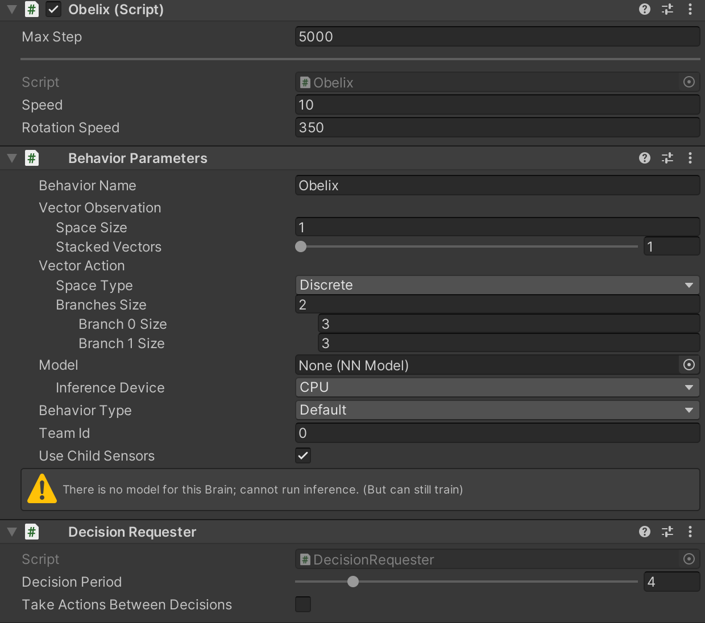
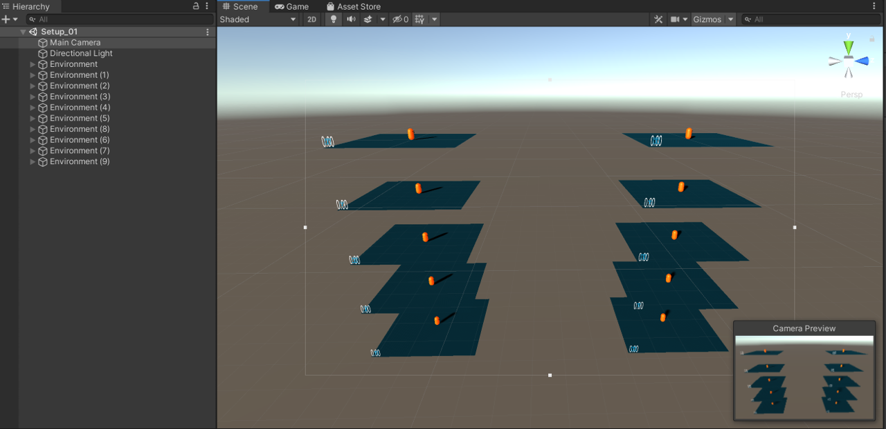

```{r include=FALSE}
library(knitr)
library(data.table)
library(magrittr)

opts_chunk$set(echo = TRUE, cache = TRUE, message = FALSE,
  warning = FALSE)

dyad <- readRDS("r/Palette_5YR_5B_Dyad.RDS")
palette(dyad[c(9, 20, 66)])
```

# Trainen van het NN

## Configuratie van het NN

Configuratie van het NN en de Python-Unity interface gebeurt hier d.m.v. een yaml-bestand (cheatsheet [hier](https://lzone.de/cheat-sheet/YAML)). Maak daarom een nieuw bestand aan met de naam `Obelix-01.yml`. We beginnen met aan te geven dat de configuratie geldt voor de Obelix agent:

```yaml
behaviors:
  Obelix:
```

Opgelet: De naam `Obelix` moet overeenkomen met de _Behavior Name_.

Je kan in het configuratiebestand meerdere gedragingen toevoegen, waarbij een gedrag overeenkomt met type agent en met een NN.

### Trainer-type

De eerste configuratie-parameter is

```yaml
    trainer_type: ppo
```

Hiermee bepaal je het type conditioneringsalgoritme en meteen ook een groot aantal andere confirguratieparameters. De mogelijkheden zijn:

- `ppo`: _Proximal Policy Optimization_ Dit algoritme zal trachten niet te ver af te wijken van de vorige set van voorgestelde acties (eng: _policy_) door een vorm van regularisatie toe te passen
- `sac`: _Soft-Actor Critic_ Is een zogenaamde _off-policy_ algoritme dat uit zijn geheugen ervaringen uit het verleden kan ophalen. Het heeft minder cycli nodig om te leren en is beter geschikt voor meer complexe omgevingen.


### Hyperparameters

Hieronder de hyperparameters op het leeralgoritme:

```yaml
    max_steps: 5.0e5
    time_horizon: 64
    summary_freq: 10000
    keep_checkpoints: 1
    checkpoint_interval: 50000
    
    hyperparameters:
      batch_size: 64
      buffer_size: 9600
      learning_rate: 3.0e-4
      learning_rate_schedule: constant
      beta: 5.0e-3
      epsilon: 0.2
      lambd: 0.95
      num_epoch: 3
```

- `max_steps`: totaal maximum aantal stappen de simulatie mag doorlopen gedurende de ganse trainingsfase
- `time_horizon`: aantal ervaringen samen te nemen alvorens deze naar de ervaringsbuffer te sturen. Een set van observaties samen met de status waarin de agent zich bevindt, dus een input-rij voor het NN, noemt men de ervaring (eng: _experience_).
- `summary_freq`: aantal ervaringen die worden samengenomen alvorens samenvattende statistieken ervan te berekenen (&approx; resolutie in Tensorboard)
- `keep_checkpoints`: Een checkpoint is een soort backup van het NN model
- `checkpoint_interval`: de frequentie waarmee de backups genomen moeten worden
- `batch_size` bepaalt de grootte van de _minibatch_. `batch_size` weerspiegelt het aantal ervaringen die worden samengenomen per optimalisatie-stap (gradiënt-afdaling, eng: _gradient descent_)
- `buffer_size` geeft het aantal ervaringen weer die worden samengenomen alvorens het leeralgoritme, in batches `batch_size` groot, de ervaringen verwerkt. Moet dus een meervoud van `batch_size` zijn
- `learning_rate` is de leersnelheid en bepaalt tijdens de optimalisatie de grootte van de stap die het leeralgoritme in de richting van de gradient neemt
- `learning_rate_schedule`: is de mate waarin de leersnelheid zich aanpast tijdens het leerproces. `constant` betekent dat de leersnelheid constant blijft en `linear` betekent dat de leersnelheid gelijkmatig afneemt naarmate het maximum aantal stappen (`max_steps`) nadert
- `beta` geeft weer hoe sterk het voorstel van een nieuw beleid wordt afgeremd en is een cruciaal onderdeel van de regularisatie van het beleid. Door middel van de entropie (Tensorboard) te volgen, kan men deze waarde bijsturen indien nodig. Daalt de entropie te snel t.o.v. een stijgende gemiddelde beloning &rarr; verhoog `beta`, daalt het te traag &rarr; verlaag `beta`
- `epsilon` is gelijkaardig aan `beta` maar bepaalt het maximum waarmee een nieuw beleid mag verschillen van het vorig voorgesteld beleid
- `lambd` is nog een regularisatie-parameter die bepaalt hoe sterk de beloningen doorwegen tijdens het aanpassen van de gewichten van de connectoren van het NN
- `num_epoch` bepaalt het aantal NN epochs per Unity frame

### Architectuur van het NN

Hieronder vind je de configuratie van de architectuur van het NN dat gekoppeld wordt met de Obelix agent:

```yaml
    network_settings:
      num_layers: 2
      hidden_units: 128
      normalize: false
```

- `num_layers`: Het aantal verborgen lagen van het NN, dus exclusief de invoer en uitvoer laag
- `hidden_units`: Het aantal neuronen of nodes per verborgen laag in het NN. Samen met `num_layers` bepaald dit de grootte van het artificieel brein.
- `normalize`: Moet eigenlijk [_standardize_](https://en.wikipedia.org/wiki/Standard_score) heten en kan belangrijk zijn wanneer men acties d.m.v. [continue variabelen](https://www.khanacademy.org/math/statistics-probability/random-variables-stats-library/random-variables-discrete/v/discrete-and-continuous-random-variables) codeert.

Als je aan je eigen agent gaat werken, moet je ook nadenken of er geheugen nodig is. Zo ja, dan kan je dit op deze manier coderen, binnen het onderdeel `network_settings` (zie [hieronder](#extra-informatie-rond-configuratie) voor links naar online documentatie hierrond):

```yaml
      memory:
        sequence_length: 64
        memory_size: 256
```

### Beloningsysteem

Het einddoel van het NN is om een beleid te vinden dat de beloning zo groot mogelijk maakt. De beloningen die in `Obelix.cs` bepaald werden, noemt men de extrinsieke beloningen (eng: _extrinsic rewards_) omdat ze door de Unity Agent en niet door het leeralgoritme zelf worden bepaald. Daarnaast kan men nog een aantal intrinsieke beloningen definiëren. Uiteindelijk zal het leeralgoritme een mix van extrinsieke en intrinsieke beloningen gebruiken.

```yaml
    reward_signals:
      extrinsic:
        strength: 1.0
        gamma: 0.99
      curiosity:
        strength: 0.02
        gamma: 0.99
        encoding_size: 256
        learning_rate : 1e-3
```

- `curiosity` is zo een intrinsieke beloning die gebruikt kan worden indien de beloningen schaars zijn en indien de kans dus klein is om beloond te worden. Door deze waarde te verhogen, verhoog je ook de kans dat de agent 'per ongeluk' de juiste actie uitvoert.
- `strength` geeft een gewicht aan het specifiek type belonging
- `gamma` is een vermenigvuldigingsfactor die aangeeft in hoeverre de agent moet anticiperen op toekomstige beloningen van dit type
- `encoding_size`: (optioneel) grootte van het intrinsiek model
- `learning_rate`: (optioneel) snelheid waarmee de `strength` mag afnemen

### Extra informatie rond configuratie

> Meer informatie rond de configuratie van agents vind je [hier](https://github.com/Unity-Technologies/ml-agents/blob/release_6_docs/docs/Training-Configuration-File.md) en [hier](https://gitee.com/mirrors/Unity-ML-Agents/blob/2a06b63ba73b8c18aae1d213a74280d7f0a8a298/docs/Training-PPO.md).

> Je kan _Environment Parameters_ definiëren in de root van jouw configuratiebestand die je dan vanuit C# kan aanspreken (zie [hier](https://github.com/Unity-Technologies/ml-agents/blob/release_6_docs/docs/Training-ML-Agents.md#environment-parameters))

> Informatie rond [algoritme families](https://spinningup.openai.com/en/latest/user/algorithms.html#the-on-policy-algorithms)

## Start de training

Hier is een stappenplan voor het starten van de training:

1. Controleer de instellingen nog eens:
   
   
   
1. Zorg dat het Unity project open is en zorg ervoor dat de _Behavior Type_ in de _Behavior Parameters_-component op _Default_ staat.
1. Navigeer naar de folder van je Unity project en maak daarin een sub-folder _Learning_
1. Kopieer het yaml configuratiebestand in deze folder
1. Open een console van je OS in deze sub-folder
1. Indien van toepassing, activeer dan de gepaste Python omgeving
1. Voer de Python `mlagents-learn` functie uit met als parameters de naam van het configuratiebestand en een naam voor de uitvoering (eng: _run_):

   ```cmd
   mlagents-learn Obelix-01.yml --run-id Obelix-01
   ```

   Krijg je het Unity logo te zien, dan zit het meestal goed. Anders moet je de foutmeldingen lezen en indien nodig opzoeken.
   
   ```
                           ▄▄▄▓▓▓▓
                   ╓▓▓▓▓▓▓█▓▓▓▓▓
              ,▄▄▄m▀▀▀'  ,▓▓▓▀▓▓▄                           ▓▓▓  ▓▓▌
            ▄▓▓▓▀'      ▄▓▓▀  ▓▓▓      ▄▄     ▄▄ ,▄▄ ▄▄▄▄   ,▄▄ ▄▓▓▌▄ ▄▄▄    ,▄▄
          ▄▓▓▓▀        ▄▓▓▀   ▐▓▓▌     ▓▓▌   ▐▓▓ ▐▓▓▓▀▀▀▓▓▌ ▓▓▓ ▀▓▓▌▀ ^▓▓▌  ╒▓▓▌
        ▄▓▓▓▓▓▄▄▄▄▄▄▄▄▓▓▓      ▓▀      ▓▓▌   ▐▓▓ ▐▓▓    ▓▓▓ ▓▓▓  ▓▓▌   ▐▓▓▄ ▓▓▌
        ▀▓▓▓▓▀▀▀▀▀▀▀▀▀▀▓▓▄     ▓▓      ▓▓▌   ▐▓▓ ▐▓▓    ▓▓▓ ▓▓▓  ▓▓▌    ▐▓▓▐▓▓
          ^█▓▓▓        ▀▓▓▄   ▐▓▓▌     ▓▓▓▓▄▓▓▓▓ ▐▓▓    ▓▓▓ ▓▓▓  ▓▓▓▄    ▓▓▓▓`
            '▀▓▓▓▄      ^▓▓▓  ▓▓▓       └▀▀▀▀ ▀▀ ^▀▀    `▀▀ `▀▀   '▀▀    ▐▓▓▌
               ▀▀▀▀▓▄▄▄   ▓▓▓▓▓▓,                                      ▓▓▓▓▀
                   `▀█▓▓▓▓▓▓▓▓▓▌
                        ¬`▀▀▀█▓
   ```

1. Je krijgt dan slechts enkele seconden om binnen de Unity GUI de &#9658;-toets in te drukken

> Je kan alternatief ook werken met [Unity Executables](https://github.com/Unity-Technologies/ml-agents/blob/release_6_docs/docs/Learning-Environment-Executable.md).

> Je kan een stopgezette trainging hervatten met de `--resume` parameter van `mlagents-learn`

> Voor hulp: `mlagents-learn --help`

De training loopt zolang `max_steps` in het configuratiebestand niet bereikt is, maar je kan de training vroeger stoppen als je wil. Je stopt de training door nogmaals de &#9658;-toets in te drukken. Tijdens de trainingsfase kan je het verloop van de gemiddelde geaccumuleerde beloning per episode volgen door middel van _Tensorboard_. Dit is het dashboard van TensorFlow dat als lokale server op jouw machine draait. Je kan Tensorboard starten dezelfde sub-folder (`Learning`):

```cmd
tensorboard --logdir results
```

In je browser ga je dan naar `http://localhost:6006` en je zou het dashboard moeten zien verschijnen. Zie &sect; [Tensorboard](#tensorboard) voor meer informatie.

## Paralleliseren

Om de trainingsfase te verkorten, kan je de omgevingen dupliceren. De agents binnen de gedupliceerde omgevingen moeten allen gekoppeld zijn met hetzelfde NN via eenzelfde _Behavior Name_ eigenschap in de _Behavior Parameters_ component.

```{r parallel-envs, fig.cap="(ref:parallel-envs)", echo=FALSE}

```

(ref:parallel-envs) Meerdere gedupliceerde omgevingen om de training te bespoedigen.
