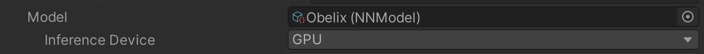
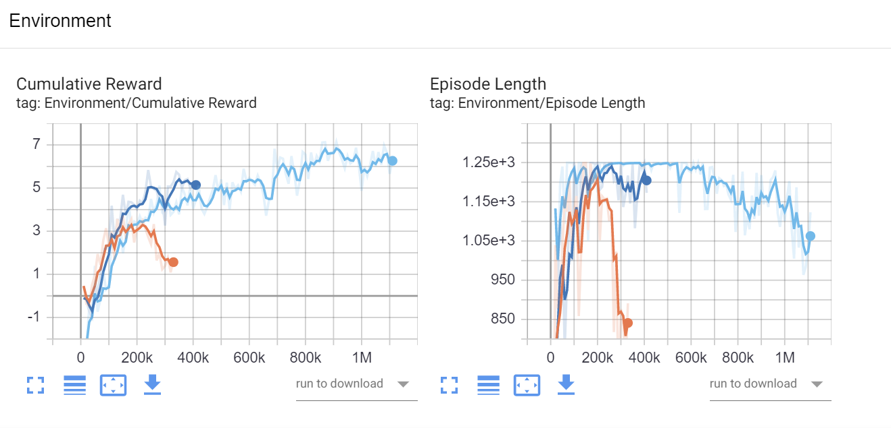
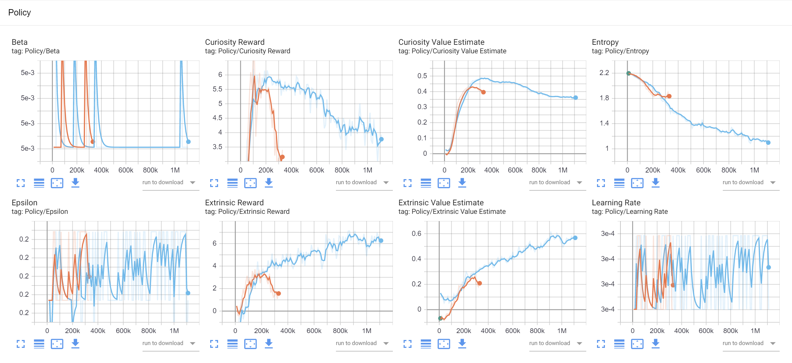

```{r include=FALSE}
library(knitr)
library(data.table)
library(magrittr)

opts_chunk$set(echo = TRUE, cache = TRUE, message = FALSE,
  warning = FALSE)

dyad <- readRDS("r/Palette_5YR_5B_Dyad.RDS")
palette(dyad[c(9, 20, 66)])
```

# Testen van een NN

## Het nn-bestand

Het belangrijkste resultaat van de trainingsfase is een `*.nn`-bestand dat het model van het NN bevat. Het kan als bestand ge-dropped in het daarvoor bedoelde veld van de _Behavior Parameters_-component.



Vanaf dit ogenblik kan je van elke Obelix een slimme Obelix maken! Als je dan opnieuw het spel start zal Unity dit brein gebruiken (eng: _inference_) en niet langer bijleren. Denk eraan om de _Behavior Type_ op _Default_ of _Inference Only_ te zetten.

## Tensorboard

Nog eens herhalen, je start een lokale Tensorboard server met `tensorboard --logdir results`. In je browser ga je naar `http://localhost:6006` en je zou het dashboard moeten zien verschijnen:

<iframe width="100%" height="650px" src="img/TensorBoard-01.html" sandbox="allow-same-origin allow-scripts allow-popups allow-forms" style="border:0px;"></iframe>

De belangrijkste grafiek is diegene die de evolutie van belonging weergeeft (links):



De andere grafieken kunnen erg afhangen van de instellingen en gaan we voor deze cursus niet dieper op in. Bovendien vereisen ze soms extra achtergrondkennis:



Wil je toch meer te weten komen over deze andere grafieken of over de andere tabs van de TensorBoard applicatie, kijk dan [hier](https://www.tensorflow.org/tutorials).

